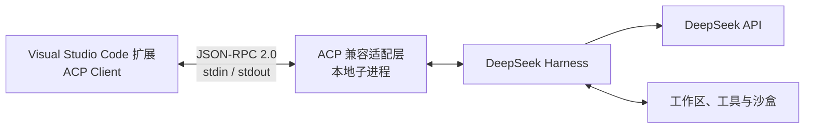
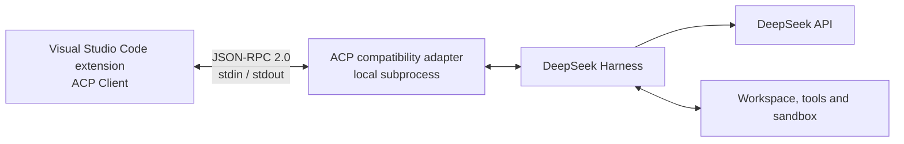

# DeepSeek Harness for Visual Studio Code

一个把 [DeepSeek Harness](https://github.com/deepseek-ai/deepseek-harness) 接入 Visual Studio Code 的非官方图形客户端，提供聊天、思考过程、Tool Call、权限审核、会话恢复和用量估算。

这是独立的 Visual Studio Code 扩展项目，通过 ACP 与外部 Harness 通信。仓库不包含 DeepSeek Harness 源码，也不包含任何私人配置、人格提示、API Key 或对话记录。

> 状态：早期预览。DeepSeek Harness 本身仍处于开发者预览阶段；在上游 ACP 入口趋于稳定之前，本扩展暂时使用固定版本的小型兼容适配层。

## 0.8.0 更新

- **图片输入（Vision）**：DeepSeek 上线 [Vision API](https://api-docs.deepseek.com/guides/vision) 后，`deepseek-v4-flash-vision-exp` 会话可以直接粘贴或附加图片（PNG / JPEG / WebP / GIF，单张 16MB、每条消息 20MB 上限），图片经 Harness 附件存储持久化后随提示词发送
- **会话级模型切换**：输入框旁新增模型选择器（V4 Pro / V4 Flash / V4 Flash Vision）。每个会话可独立选择模型；已有上下文的会话切换模型时会重建 Harness 上下文（本地聊天记录保留）
- 外部 Harness 固定版本升级到 `dsh-v0.1.1-rc.1`（`528c682e06`），全部 5 个兼容补丁已重新移植，并新增第 6 个补丁 `acp-session-model.patch`（会话级模型覆盖与逐会话图片准入）
- Cordis 配置新增 `@deepseek-ai/dsh-attachment-local` 附件存储与 Vision 模型条目
- 新增 `smoke:vision` 冒烟测试（模型覆盖、图片准入门控、非法模型 ID 拒绝，全部无需 API Key）

从 0.7.x 更新时请重新运行 `adapter\setup.ps1`，让固定版本的外部 Harness 重新构建；脚本不会覆盖已有的 `.credentials.yaml`。旧版本 Harness 保存的会话可以在新版本中正常恢复（已验证）。

## 0.7.2 更新

- 设置页新增中文、英文、日文界面切换；仅翻译扩展固定 UI，不改写 Harness、Tool Call 或错误原文
- 页面上方新增 Goal 与 Subagent 状态面板，可查看目标阶段、暂停/恢复/清除目标，并区分工作中、空闲和已结束的子 Agent
- 点击上下文占用环会打开用量弹窗，可直接选择 `Compact` 或 `/clear`
- 优化长对话内存占用：限制运行时缓存与 Tool Call 缓存、分批渲染旧消息、节流流式重绘和持久化写入
- `@` 工作区文件建议会隐藏凭据、`.env`、`.deepseek`、私钥和其他常见敏感路径
- 输入框旁新增上下文占用环，并在用量弹窗中显示 Context、TTFT 和输出速度
- 忙碌时按 Enter 排队；`Ctrl+Enter` 会把全部队列连同当前输入一起作为插话发送
- 会话列表支持标题/内容搜索（最多 20 项）、归档与 Fork。当前 ACP 没有原生会话 Fork，因此 Fork 会复制可见记录，并启动一个新的独立 Harness 会话
- 新增结构化提问与 Plan 审核卡片；Harness 可以在继续执行前等待单选、多选或自定义回答
- 输入 `/` 可打开斜杠菜单；支持 `/compact`、`/clear`、`/new`、`/history`、`/archive`、`/fork`、`/plan`、`/code`、`/settings` 和 `/help`
- 用量估算更新为 DeepSeek V4 Pro 当前官方美元单价

功能组开关只控制仓库随附 Cordis 配置中已经存在的组件，不会自动下载或删除外部插件代码。

从 0.6.x 更新时请重新运行 `adapter\setup.ps1`，让固定版本的外部 Harness 重新构建本版兼容接口；脚本不会覆盖已有的 `.credentials.yaml`。

## 功能

- 在编辑器标签页中提供完整聊天界面
- 流式回答，以及可显示、折叠或隐藏的思考内容
- 可审核和折叠的 Tool Call 与权限确认
- 全部手动、工作区沙盒、全部放行三档权限模式
- 持久化对话列表、重命名、恢复对话和未读红点
- 原生 diff 与工作区文件引用
- 打断、引导和 Compact
- 统一的设置与管理窗口、`/clear` 与明确的停止确认状态
- Harness 可选功能组、日志、诊断和运行时重启
- 上下文占用、TTFT、输出速度，以及 Input、Output、缓存命中和费用估算
- 忙碌时的消息排队与 `Ctrl+Enter` 插话
- 会话搜索、归档和本地记录 Fork
- 结构化提问、Plan 审核卡片与斜杠命令
- 中文、英文、日文固定界面切换
- Goal 目标条与 Subagent 状态面板
- 会话级模型切换（V4 Pro / V4 Flash / V4 Flash Vision）
- Vision 会话中的图片粘贴与附加（PNG / JPEG / WebP / GIF）

费用面板仅做参考估算。V4 Pro 当前官方美元价（每百万 Token）为缓存命中 `$0.003625`、未命中输入 `$0.435`、输出 `$0.87`；中文计价页对应 ¥0.025、¥3、¥6。最终账单以 DeepSeek 为准。

## ACP 是什么，以及本项目如何使用它

[Agent Client Protocol（ACP）](https://agentclientprotocol.com/get-started/introduction) 是连接代码编辑器与编程 Agent 的开放协议，作用类似于 LSP 把编辑器和语言服务器解耦。对于本地 Agent，编辑器通常启动一个子进程，并通过标准输入/输出交换双向 JSON-RPC 消息：客户端发送提示词、会话控制和取消请求；Agent 则流式返回文本、思考、Tool Call、diff 等更新，也可以反向请求客户端进行权限确认。详见 [ACP 架构说明](https://agentclientprotocol.com/get-started/architecture)。



在本项目中，Visual Studio Code 扩展负责聊天 UI、会话控制和人工审核；兼容适配层启动外部 DeepSeek Harness，并把两边的 ACP 消息相互转发。连接时先通过 `initialize` 协商协议版本，随后使用 `session/new`、`session/resume`、`session/prompt` 和 `session/cancel` 管理对话。Harness 发出的流式更新与 `session/request_permission` 请求会返回扩展，由界面展示或交由使用者决定。

ACP 与 MCP 不是同一种协议：ACP 主要连接编辑器与 Agent，MCP 主要帮助 Agent 接入外部工具和数据源，两者可以同时使用。本项目中的 ACP 链路在本机进程之间运行，但 Harness 调用模型时仍会访问 DeepSeek API；提示词、选中的文件、工作区上下文和工具结果仍可能被发送到服务端。

## 项目边界

这个仓库只包含：

- Visual Studio Code 扩展；
- 小型 ACP 兼容适配层；
- 安装和检查脚本；
- 公开文档。

官方 Harness 仓库及其依赖安装在本项目之外。API Key、会话、skills 和可选的 `persona.md` 也保存在机器本地，不进入 Git。

## 安装

本项目只公开源码，不发布或分发预先打包的 `.vsix`，也不上架 Visual Studio Marketplace。每位使用者需要自行准备外部 Harness、在本地打包扩展，再安装自己生成的 VSIX。扩展会检查外部 Harness 是否缺失并提供安装说明入口，但不会自动下载或修改 Harness。

参见[安装说明](docs/INSTALL.md)；如果希望让 Codex、Claude Code 等 Agent 协助安装，可使用[面向 Agent 的安装说明](docs/INSTALL_FOR_AGENTS.md)。准备完成后，按 `Ctrl+Alt+D`，或从命令面板运行本扩展的 `Open Chat` 命令。

## 开发

```powershell
npm.cmd run check
npm.cmd run smoke:approval
npm.cmd run smoke:auto-approval
npm.cmd run smoke:security
npm.cmd run smoke:feature-groups
npm.cmd run smoke:ui-features
npm.cmd run smoke:i18n
npm.cmd run package
```

集成测试依赖外部 Harness 环境，因此不会混入默认检查。

## 安全

扩展默认使用全部手动审核。全部放行模式会移除重要的安全边界，并明确标记为“超危险”。请认真检查 Tool Call，把凭据保存在 Git 仓库之外，并且只在完全可信的工作区中启用更宽松的权限。

提示词、选择的文件、工作区上下文、工具结果及其他对话数据可能会经 DeepSeek Harness 发送至 DeepSeek API。使用者需要自行判断可以发送哪些数据，并遵守适用的 DeepSeek 服务条款、隐私规则和 API 计费要求。本项目自身不收集额外的分析数据或遥测。

## 免责声明

这是一个以 vibecoding 方式制作、按现状提供且不附带担保的非官方个人项目。详见 [DISCLAIMER.md](DISCLAIMER.md)。

DeepSeek 与 DeepSeek Harness 属于其各自权利人。本项目与 DeepSeek 不存在隶属或官方认可关系。

---

## English

An unofficial graphical client that brings [DeepSeek Harness](https://github.com/deepseek-ai/deepseek-harness) into Visual Studio Code, with chat, thought display, tool calls, permission review, session recovery and usage estimates.

This is a standalone Visual Studio Code extension that communicates with an external Harness over ACP. It does not contain the DeepSeek Harness source tree, private configuration, persona prompts, API keys, or conversation records.

> Status: early preview. DeepSeek Harness itself is currently a developer preview, and this extension uses a pinned compatibility adapter while the upstream ACP entry point is still evolving.

### What is new in 0.8.0

- **Image input (Vision)**: with the DeepSeek [Vision API](https://api-docs.deepseek.com/guides/vision) live, `deepseek-v4-flash-vision-exp` conversations accept pasted or attached images (PNG / JPEG / WebP / GIF, 16MB per image, 20MB per message). Images persist through the Harness attachment store and travel with the prompt
- **Per-conversation model switching**: a model picker (V4 Pro / V4 Flash / V4 Flash Vision) now sits beside the composer. Each conversation selects its own model; switching a conversation that already has context starts a fresh Harness context (the local chat log is kept)
- The pinned external Harness moved to `dsh-v0.1.1-rc.1` (`528c682e06`); all five compatibility patches were re-ported and a sixth patch `acp-session-model.patch` adds per-session model overrides with per-session image admission
- The bundled Cordis composition now mounts `@deepseek-ai/dsh-attachment-local` and registers the vision model
- Added a `smoke:vision` test covering model overrides, image admission gating and malformed-model rejection, all without an API key

When updating from 0.7.x, rerun `adapter\setup.ps1` so the pinned external Harness is rebuilt. The script does not overwrite an existing `.credentials.yaml`. Sessions persisted by the previous pin resume correctly on the new build (verified).

### What is new in 0.7.2

- Added Chinese, English and Japanese UI switching. Only extension-owned chrome is translated; Harness, tool-call and error payloads remain verbatim
- Added Goal and Subagent dashboards above the conversation, including goal pause/resume/clear controls and working/idle/ended subagent states
- Clicking the context ring now opens the usage popover with direct `Compact` and `/clear` actions
- Reduced long-session memory use with bounded runtime/tool caches, paged rendering of older messages, and throttled streaming renders and state saves
- Workspace `@` suggestions now hide credentials, `.env`, `.deepseek`, private keys and other common sensitive paths
- Added a context-occupancy ring beside the composer, with Context, TTFT and output-throughput details in the usage popover
- Enter queues a message while the agent is busy; `Ctrl+Enter` steers with the complete queue plus the current input
- Session history now supports title/content search (up to 20 results), archive and Fork. ACP has no native session-fork method, so Fork copies visible records and starts a separate Harness session
- Added structured single-choice, multiple-choice, custom-answer and Plan-review cards that can pause Harness until answered
- Typing `/` opens a command menu for `/compact`, `/clear`, `/new`, `/history`, `/archive`, `/fork`, `/plan`, `/code`, `/settings` and `/help`
- Usage estimates now use the current official DeepSeek V4 Pro USD rates

Feature-group switches only control components already present in the bundled Cordis configuration. They never download or remove external plugin code.

When updating from 0.6.x, rerun `adapter\setup.ps1` so the pinned external Harness is rebuilt with this version's compatibility interface. The script does not overwrite an existing `.credentials.yaml`.

### Features

- Full editor-tab chat UI
- Streaming responses and optional thought display
- Reviewable, collapsible tool calls and permission prompts
- Manual, workspace-sandbox and unrestricted approval modes
- Persistent conversation list, rename, resume and unread indicators
- Native diffs and workspace file references
- Interrupt, steer and compact controls
- Unified settings and management, `/clear`, and explicit stop confirmation states
- Optional Harness feature groups, logs, diagnostics and runtime restart
- Context occupancy, TTFT, output throughput, input/output/cache usage and cost estimates
- Queued prompts and `Ctrl+Enter` steering during active turns
- Session search, archive and local-record Fork
- Structured questions, Plan review cards and slash commands
- Chinese, English and Japanese fixed-UI switching
- Goal and Subagent status dashboards
- Per-conversation model switching (V4 Pro / V4 Flash / V4 Flash Vision)
- Image paste and attach in Vision conversations (PNG / JPEG / WebP / GIF)

Cost figures are estimates only. Current official V4 Pro rates per million tokens are `$0.003625` cache hit, `$0.435` cache-miss input and `$0.87` output; the Chinese pricing page lists ¥0.025, ¥3 and ¥6 respectively. DeepSeek billing remains authoritative.

### What ACP is and how this project uses it

[Agent Client Protocol (ACP)](https://agentclientprotocol.com/get-started/introduction) is an open protocol connecting code editors to coding agents, much like LSP decouples editors from language servers. For a local agent, the editor typically starts a subprocess and exchanges bidirectional JSON-RPC messages over standard input and output. The client sends prompts, session controls and cancellation requests; the agent streams text, thoughts, tool calls, diffs and other updates back, and can request permission from the client. See the official [ACP architecture documentation](https://agentclientprotocol.com/get-started/architecture).



In this project, the Visual Studio Code extension owns the chat UI, session controls and human approval flow. The compatibility adapter starts the external DeepSeek Harness and relays ACP messages in both directions. The connection negotiates a protocol version through `initialize`, then uses `session/new`, `session/resume`, `session/prompt` and `session/cancel` to manage conversations. Streaming updates and `session/request_permission` calls from Harness return to the extension for display or a human decision.

ACP and MCP serve different roles: ACP primarily connects an editor to an agent, while MCP primarily connects an agent to external tools and data sources; they can be used together. The ACP link used here stays between local processes, but Harness still reaches the DeepSeek API for model calls. Prompts, selected files, workspace context and tool results may therefore still be sent to the service.

### Project boundary

This repository contains only:

- the Visual Studio Code extension;
- a small ACP compatibility adapter;
- setup and verification scripts;
- public documentation.

The official Harness checkout and its dependencies are installed outside this repository. Machine-local credentials, sessions, skills and optional `persona.md` also stay outside Git.

### Installation

This is a source-only project. The repository does not publish or distribute prebuilt `.vsix` files and is not listed on the Visual Studio Marketplace. Each user prepares the external Harness, packages the extension locally, and installs the locally generated VSIX. The extension detects missing runtime files and links to the setup guide, but deliberately does not download or modify Harness automatically.

See [Installation](docs/INSTALL.md) or [Agent-assisted installation](docs/INSTALL_FOR_AGENTS.md). After setup, use `Ctrl+Alt+D` or run this extension's `Open Chat` command from the Command Palette.

### Development

```powershell
npm.cmd run check
npm.cmd run smoke:approval
npm.cmd run smoke:auto-approval
npm.cmd run smoke:security
npm.cmd run smoke:feature-groups
npm.cmd run smoke:ui-features
npm.cmd run smoke:i18n
npm.cmd run package
```

Integration tests require an external Harness checkout and are intentionally separate from the default check.

### Security

The extension defaults to manual approval. The unrestricted mode removes meaningful safety boundaries and is marked as extremely dangerous. Review tool calls, keep credentials out of repositories, and only enable broader permissions in workspaces you fully trust.

Prompts, selected files, workspace context, tool results, and other conversation data may be sent through DeepSeek Harness to the DeepSeek API. Users are responsible for deciding what data to send and for complying with the applicable DeepSeek service terms, privacy rules, and API charges. This project does not collect separate analytics or telemetry.

### Disclaimer

This is an unofficial, vibecoded personal project provided as-is and without warranty. See [DISCLAIMER.md](DISCLAIMER.md).

DeepSeek and DeepSeek Harness belong to their respective owners. This project is not affiliated with or endorsed by DeepSeek.
